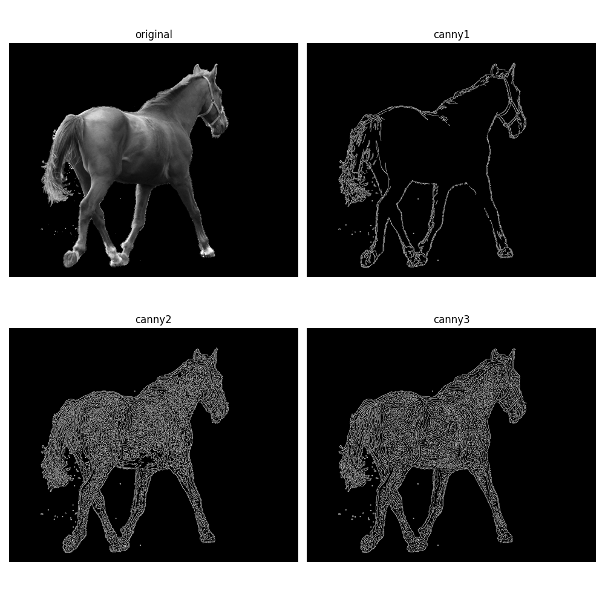

<hr/>

# OpenCV - Python

> ### Ex_Image_01.py
>
> <hr/>
>
> ### 1. 이미지 입력
>
> ```python
> cv2.imread(fileName, flags = cv2.IMREAD_COLOR)
> ```
>
> ### 2. 이미지 출력
>
> ```python
> cv2.nameWindow(winname, flags = None)
> cv2.resizeWindow(winname, width, height)
> cv2.imshow(winname, ndarray)
> cv2.waitKey(0)
> cv2.destroyAllWindows()
> ```
>
> ### 3. 이미지 저장
>
> ```python
> cv2.imwrite(filename, img, params = None)
> ```

> ### Ex_Image_02.py
>
> <hr/>
>
> ### 이미지 가장자리 검출: Canny Edge Detection
>
> ```python
> dst = cv2.Canny(src, threshold1, threshold2, apertureSize = None, L2gradient = None)
> ```
>
> </img>

> ### Ex_Image_03.py
>
> <hr/>
>
> ### 1. 이미지 확대
>
> ```python
> cv2.pyrUp(src, dstSize = None, borderType = None)
> ```
>
> ### 2. 이미지 축소
>
> ```python
> cv2.pyrDown(src, dstSize = None, borderType = None)
> ```

> ### Ex_Image_04.py
>
> <hr/>
>
> ### 1. 이미지 자르기
>
> ```python
> dst = src[120:600, 340:705]
> ```
>
> ### 2. 이미지 붙여넣기
>
> ```python
> roi = src[120:620, 240:740]
> dst[0:500, 0:500] = roi
> ```
>
> ### 3. 이미지 크기 조절
>
> ```python
> dst = cv2.resize(src, dsize, fx = None, fy = None, interpolation = None)
> ```

<hr/>

# 링크

- 마크다운 markdown 작성법:
  <https://gist.github.com/ihoneymon/652be052a0727ad59601#this-is-a-h1>
- Image Gradients - Canny Edge Detection:
  <https://dsbook.tistory.com/214>
